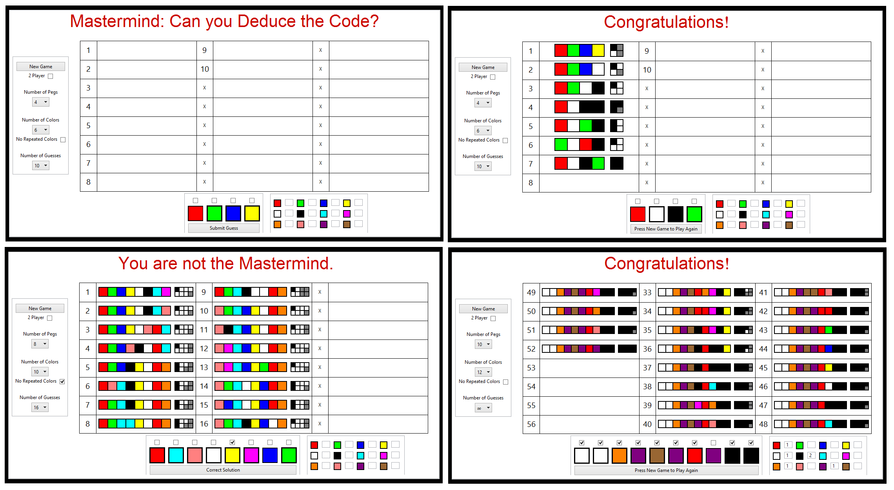
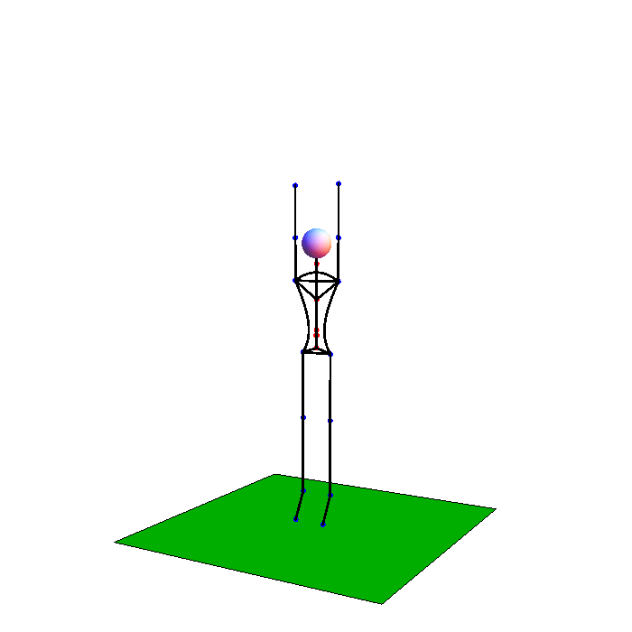

# Projects for fun in Mathematica

During my time as an undergraduate, I used Mathematica extensively. Often I
just used it to complete homework assignments and explore physics, but, when I
found extra time during finals week, I would work on personal projects that
were interesting and fun. These programs are the results of these times.

## Mastermind

My implementation of the Mastermind board game using Mathematica for the logic
and visuals. If you are unfamiliar with this code breaking game, check out the
wiki at http://en.wikipedia.org/wiki/Mastermind_(board_game). It was my first
project implementing a game in any language. One particularly cool aspect of my
version is that you can have up to 10 pegs each with up to 12 colors (with or
without repeats) and allows you to choose the number of guesses from 1-24 or
infinite. There are also modes for both one player and two. This game is a good
way to eat up some time and practice logical thinking.

## Stick Figure Gymnast

This project developed out of my interest for computer graphics and gymnastics.
At the end of high school, I learned some gymnastics as part of my senior
project. It was always helpful to be able to visualize the movements before
attempting the skill. I created this program to assist with that.

A stick figure is constructed from anthropometric data that I found in a paper
documenting the size of aircraft pilots. This figure is completely movable, with
all joints and rotations programmable. Using this, I created an animation of where
the stick figure performs a standing back tuck that looks quite realistic. I had
hopes to produce other animations, but ran out of time on the project and had to
focus on classes again.

## License

The MIT License (MIT)

Copyright (c) 2014 Travis Johnson

Permission is hereby granted, free of charge, to any person obtaining a copy
of this software and associated documentation files (the "Software"), to deal
in the Software without restriction, including without limitation the rights
to use, copy, modify, merge, publish, distribute, sublicense, and/or sell
copies of the Software, and to permit persons to whom the Software is
furnished to do so, subject to the following conditions:

The above copyright notice and this permission notice shall be included in all
copies or substantial portions of the Software.

THE SOFTWARE IS PROVIDED "AS IS", WITHOUT WARRANTY OF ANY KIND, EXPRESS OR
IMPLIED, INCLUDING BUT NOT LIMITED TO THE WARRANTIES OF MERCHANTABILITY,
FITNESS FOR A PARTICULAR PURPOSE AND NONINFRINGEMENT. IN NO EVENT SHALL THE
AUTHORS OR COPYRIGHT HOLDERS BE LIABLE FOR ANY CLAIM, DAMAGES OR OTHER
LIABILITY, WHETHER IN AN ACTION OF CONTRACT, TORT OR OTHERWISE, ARISING FROM,
OUT OF OR IN CONNECTION WITH THE SOFTWARE OR THE USE OR OTHER DEALINGS IN THE
SOFTWARE.
